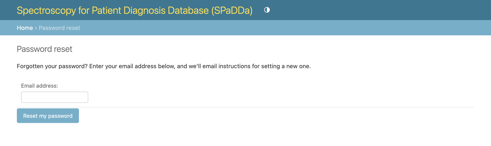

Login and Accounts
------------------

Registration
^^^^^^^^^^^^

User access to the website is not open to the general public. For access, please reach out to the site administrator
and/or your center/institute/hospital's collaborator affiliated with this website.

.. note::

   Administrator contact instructions have been intentionally omitted from this manual.

Permissions
^^^^^^^^^^^

User access can be generally broken down into the following tiers:

 - Access to `/catalog/ <../../catalog/>`_: This will be the most common permission granted and gives you access to browse and download pre-canned datasets from the :doc:`datasets`.
 - Access to `/data/ <../../data/>`_: This is intended for affiliated center/institute/hospital's predominantly for the act of :doc:`data_collection`.
 - Access to `/explorer/ <../../explorer/>`_: The :doc:`sql_explorer` app requires privileged permissions bordering on admin level permissions. This grants read access to execute arbitrary (but read only) SQL queries directly to the clinical database.
 - Access to `/admin/ <../../admin/>`_: This is intended for administrator access only, however, some simplified forms for data access and ingestion are granted automatically for those that have permissions to access /data/.

Login
^^^^^

The login page will look like the following.

.. note:: Upon registration, the site administrator will provide you with your username and initial temporary password. Please login and immediately change this temporary password. See `Password Reset`_.

Password Reset
^^^^^^^^^^^^^^

To change your password go to `admin/password_change/ <../../admin/password_change/>`_. A link to this is also provided on the home landing page.

If you have forgotten your username and password, click on the `Forgotten your password or username? <../../admin/password_reset/>`_ link as shown below.

You will then be directed to enter the email address associated with your user account so that a one-time password reset link can be emailed to you.

.. note:: If the given email address was not previously registered, no email will be sent.

User Profile
^^^^^^^^^^^^

.. note:: There is no user profile page or user management of your details, i.e., name, email address etc. Changes to user details can be made only via a request to the site administrator.
