Data Collection
---------------

Usage
^^^^^

The central `data collection page <../../data/>`_  looks like the following.

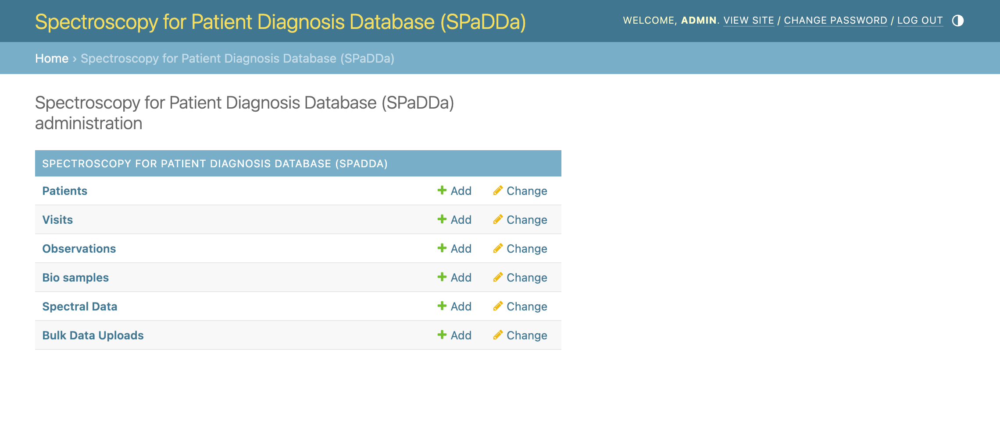

From the central `data collection page <../../data/>`_ you can view, add, and edit (permissions required) the following types of data forms.
Each form below includes all forms for those listed below it, excluding that for Bulk Data Uploads.

 - Patients_: This is the principle form for collecting data for new (or returning) individual patients. **This is probably the only form you need to use.**
 - Visits_: Every patient's data is contained within the concept of a "visit". This form can be used for collecting additional data for returning patients already in the database.
 - Observations_: Use this form to collect a patient's "observables" that represent a variety of types of meta data. E.g., age, blood pressure, lab test results, comorbidities etc.
 - BioSamples_: Use this form to collect information in regard to how the biological sample was taken, e.g., blood, nasal swab, urine etc. This sample is that processed to collect a patient's spectroscopy data.
 - SpectralData_: Use this form to upload a patient's spectroscopy data associated with the above observables taken at a given visit.
 - `Bulk Data Uploads`_: Use this form for convenience to upload multiple patients at the same time (privileged permission required).

Viewing
^^^^^^^

The first thing to note is that clicking on any of these will take you to the corresponding "list" view of all the data of that kind that you have permission to view.
Normally, your permission to view data is limited to that collected exclusively by your center/institute/hospital (specified upon user membership registration).

For example, `patients <../../data/uploader/patient/>`_ may look like this.

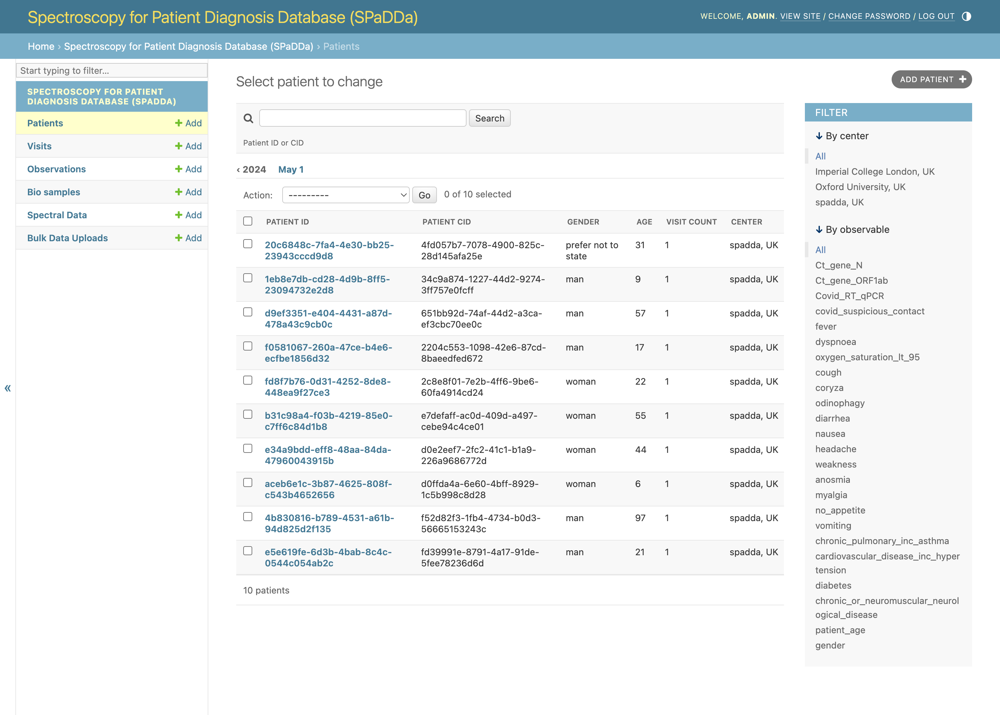

Patients can be filtered by their ``CID``, this is the anonymized or pseudonymized Center ID, i.e., that given for that patient by the center.

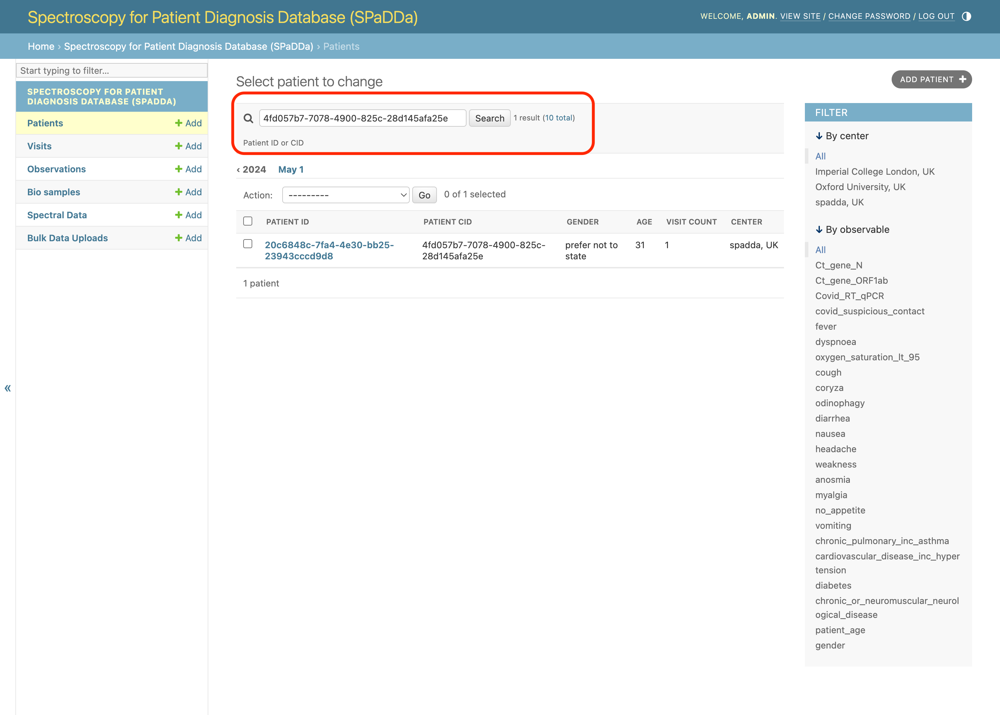

Patients can also be filtered by their observables, for example, whether data was collected for the selected observable, or for booolean types, whether the data value is ``True``.
In the example below we filter patients by those that have results for a Covid ``Ct_gene_N`` test.

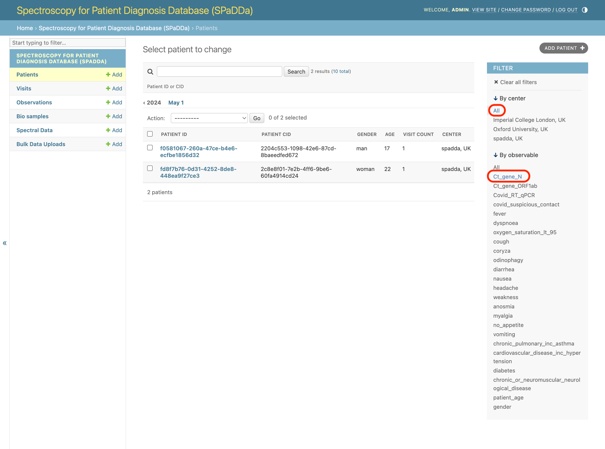

Adding
^^^^^^

To add new data simply click any of the ``+Add`` buttons.

 - For collecting *new* patient data click on the ``+Add`` button next to the ``Patients`` tab on the left.
 - For collecting additional data for *returning* patients click on the ``+Add`` button next to the ``Visits`` tab on the left.

When adding data via the numerous data collection forms outlined below, one thing to note are those fields that are *required* from those that are *optional* (blank).
Fields shown in **bold** are required and optional otherwise as shown below (those circled in red are required and those in green are optional).

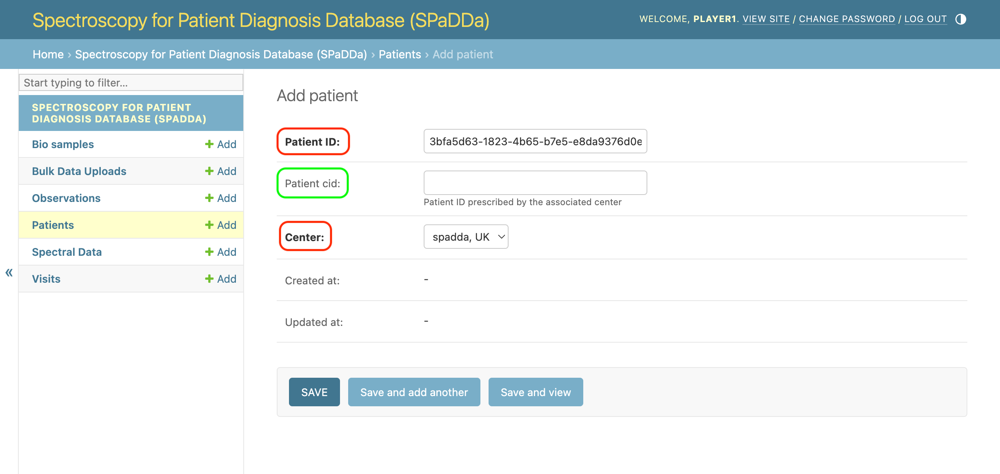

Editing
^^^^^^^

To edit existing data, e.g., for an existing patient click on the ``Patient ID`` from the patient list view as shown below.

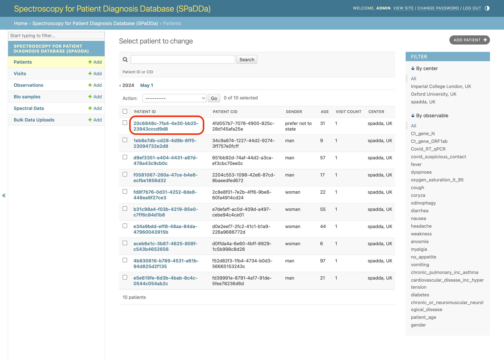

.. note:: You may not have adequate user permissions to edit data.

Deleting
^^^^^^^^

To delete data, check all required checkboxes for the given content to be deleted, then, for example, select ``Delete selected patients``  from the ``Action`` drop down, and click ``go``.
As shown below.

.. note:: Don't worry, this won't delete the data just yet, instead, a confirmation page is loaded and further action is required.

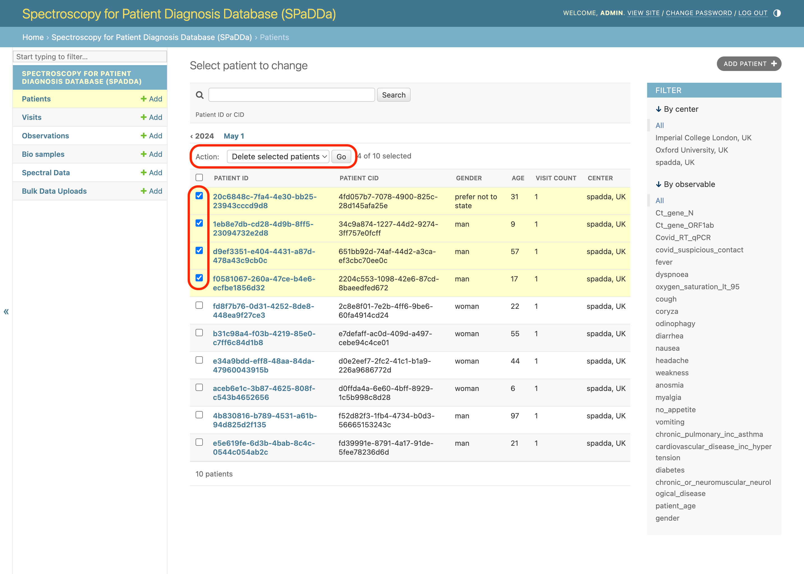

This will then take you to a summary of all the database entries that will be deleted as a consequence of your deletion request.
To confirm the deletion, click ``Yes, I'm sure``.

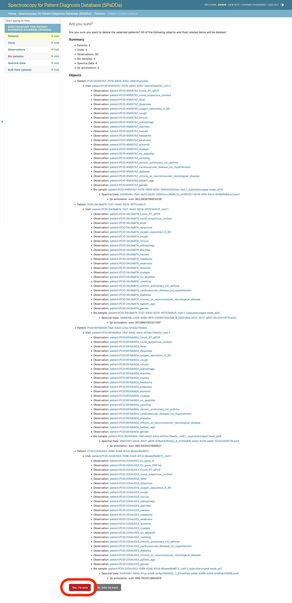

.. note:: You may not have adequate user permissions to delete data.

Patients
^^^^^^^^

Below is an example of the fields present for a patient form.
The ``Patient ID`` is an auto generated `UUID <https://en.wikipedia.org/wiki/Universally_unique_identifier>`_, however, the ``Patient CID`` is provided by the user adding the patient.
The ``center`` field will automatically be populated with your user center. This is neither optional nor editable.

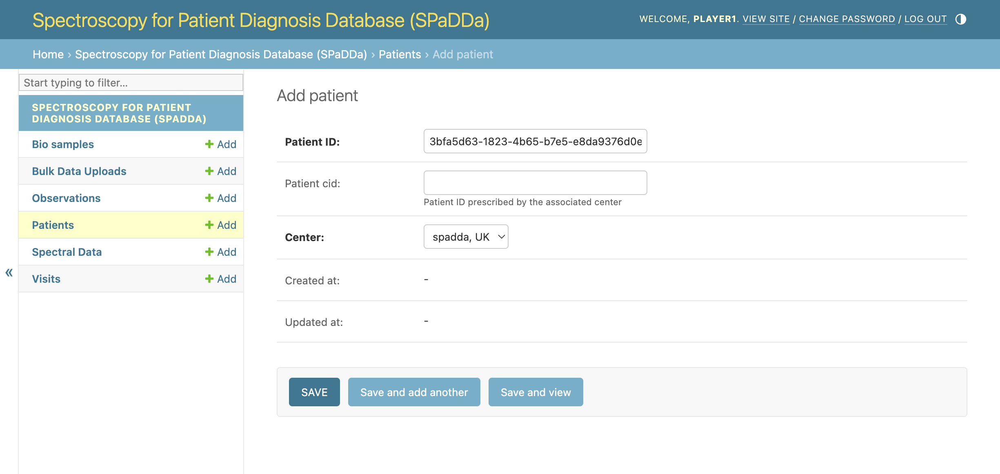

.. warning:: The ``Patient CID`` is optional, however, if provided it must **NOT** contain PII. It **MUST** be either a *fully anonymized* or a *pseudonymized* identifier.

Whilst the above shows you the basic fields belonging to the ``Patient`` database model, the principle form for data collection is more extensive and includes forms for all aspects of data collection for a given patient.
As shown below.

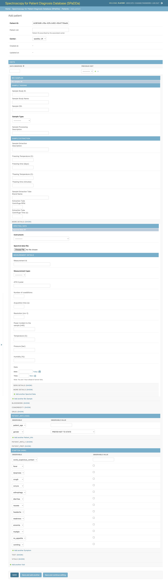

Visits
^^^^^^

A "visit" represents a physical visit to a care provider in which both questionnaire data and biosample data (to be spectroscopically analyzed) are collected.
It is used predominately to facilitate in the collection of longitudinal patient data allowing for an individual patient to have multiple data collections over time.
It has next to no fields of its own. The only notable field is ``Days observed`` which *can* be used to apply to that of all observations related to this visit.

Observations
^^^^^^^^^^^^

This form is used to collect a patient's "observables". Observables represent all questionnaire data (patient meta data) and diagnostic data associated with the given patient for their given visit.
Observations are one of the two principle data types collected.

A single observation's fields are:

 - **Observable:** A drop-down selection of possible observations for your user center.
 - **Observable value:** The value for this observation, e.g., "None", True|False, N/A, 10, 0.5, etc.

As shown below.

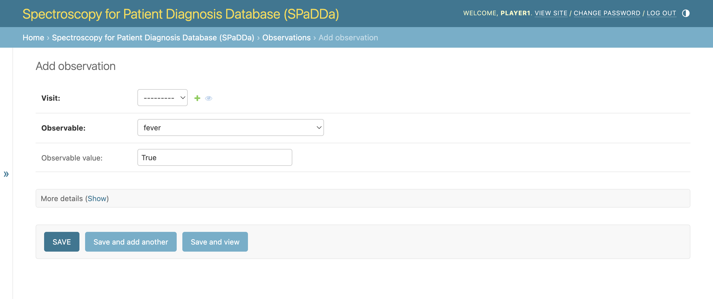

Observables are grouped into the following categories:

 - Bloodwork
 - Comorbidity
 - Drug
 - Patient Info
 - Patient Info II
 - Patient Prep
 - Symptom
 - Symptom
 - Test
 - Vital

.. note:: Some categories may be empty having no associated observables to select from.

BioSamples
^^^^^^^^^^

A "BioSample" is all the data relevant to the physical biological sample taken from the patient.
This biological sample will then be spectroscopically analyzed and uploaded on the SpectralData_ page.

Below is an example of the ``BioSample`` collection form.

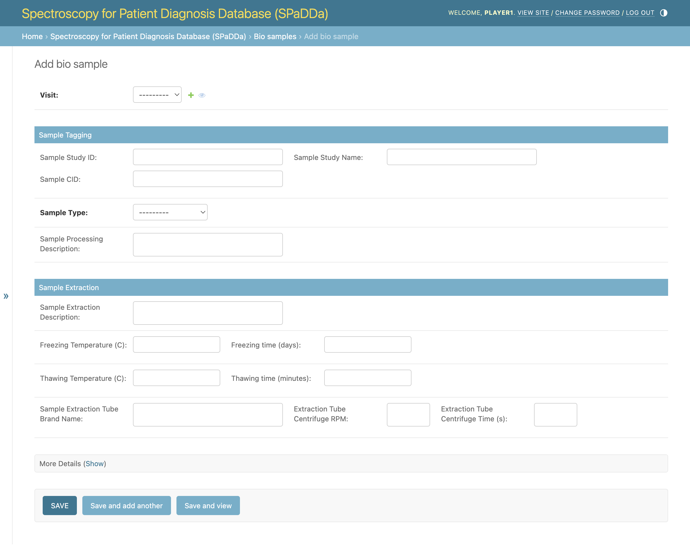

SpectralData
^^^^^^^^^^^^

This is the *actual* spectroscopy data file.
Spectroscopy data is one of the two principle data types collected.

Below is an example of the ``SpectralData`` collection form. The principle fields here are the ``Instrument`` used to spectroscopically analyze the biosample and the ``Spectral data file`` field used to upload the data file.

.. image:: ../_static/spectraldata.png

.. note:: Privileged permissions are required to add ``Instruments`` to the database. If you do not see your specific instrument in the selection box, please reach out to the website administrator.

The allowed file formats for this data file are ``.csv``, ``.xlsx``, and ``.json``.

The data is expected to be of the following table layout of just two rows. The first colum is the ``Patient ID`` with all other column headers being the wavelength value and the second row their amplitude values.

+--------------------------------------+-------------+-------------+-------------+-----+-------------+-------------+-------------+
| Patient ID                           | 4000        | 3998.137375 | 3996.27475  | ... | 656.5878754 | 654.7252503 | 652.8626251 |
+======================================+=============+=============+=============+=====+=============+=============+=============+
| b933bf6e-54fd-4c76-9e1d-8b8e220b27fa | 0.100503863 | 0.957369651 | 0.820841317 | ... | 0.203205173 | 0.161018822 | 0.893624159 |
+--------------------------------------+-------------+-------------+-------------+-----+-------------+-------------+-------------+

Specific examples for each format can be found on `GitHub <https://github.com/RISPaDD/biospecdb/tree/main/biospecdb/apps/uploader/tests/data>`_.
E.g., `sample.csv <https://github.com/RISPaDD/biospecdb/blob/main/biospecdb/apps/uploader/tests/data/sample.csv>`_.

Bulk Data Uploads
^^^^^^^^^^^^^^^^^

For data collection of multiple patients and visits, this form can be used to upload tables of data.

Below is an example of the ``Bulk Data Upload`` collection form.

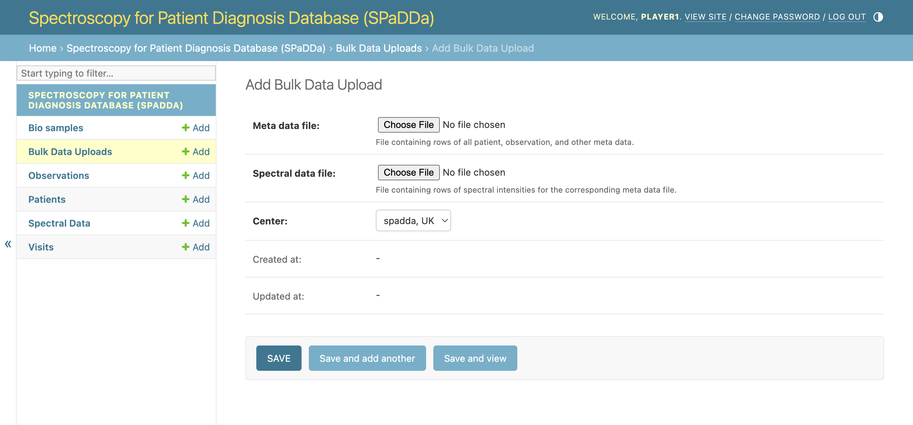

.. note:: Privileged permissions are required to add data via the ``Bulk Data Upload`` form.

The allowed file formats both data files are ``.csv``, ``.xlsx``, and ``.json``.

The expected data table layout for the ``Spectral data file`` is the same as that stated above for SpectralData_, however, multiple rows are allowed with each representing a single patient's data file.

The ``Meta data file`` contains *all* other data to be uploaded as a table where each column represents a specific field to be parsed and a row per patient containing the field values.

The ``Meta data file`` will include patient ``observations`` with a column header for each ``observable`` name.
The observable names are aliased to more human readable names, and since these are dynamic within the database they cannot be statically listed within this manual.
Furthermore, since privileged permissions are required to use this form, please reach out to the site administrator for a list of all meta data column names.

Specific examples for each format can be found on `GitHub <https://github.com/RISPaDD/biospecdb/tree/main/biospecdb/apps/uploader/tests/data>`_.
E.g., `meta_data.csv <https://github.com/RISPaDD/biospecdb/blob/main/biospecdb/apps/uploader/tests/data/meta_data.csv>`_ and `spectral_data.csv <https://github.com/RISPaDD/biospecdb/blob/main/biospecdb/apps/uploader/tests/data/spectral_data.csv>`_.

