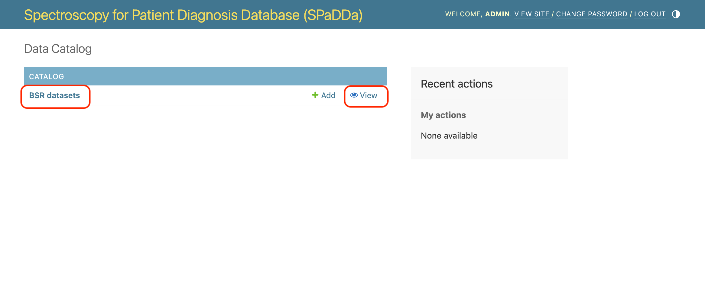
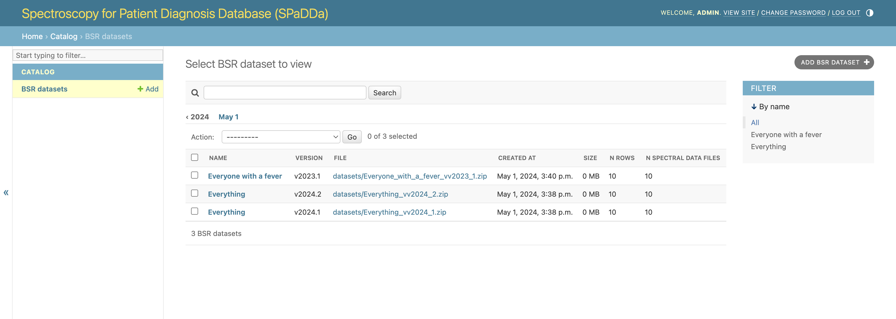
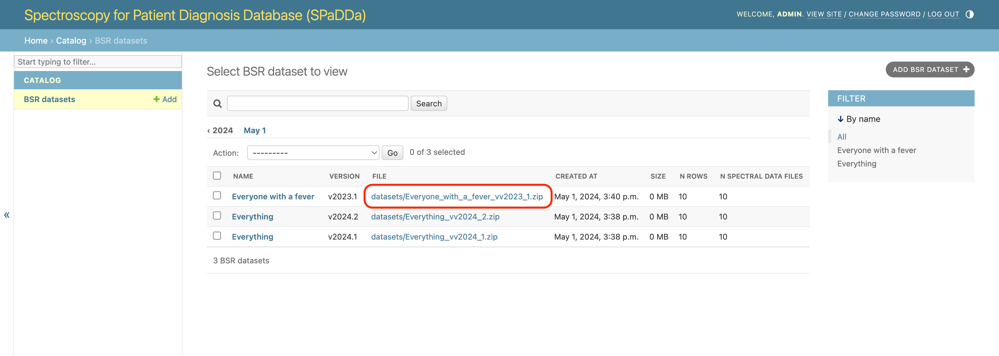
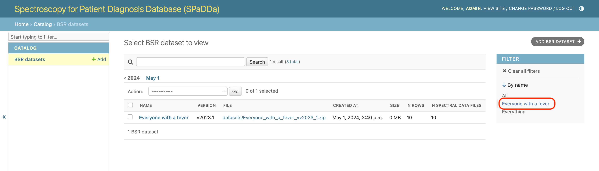
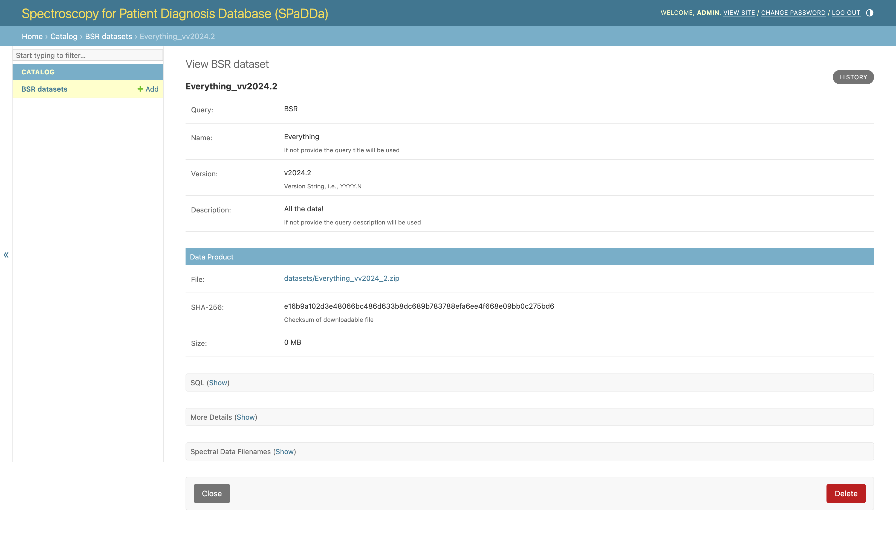
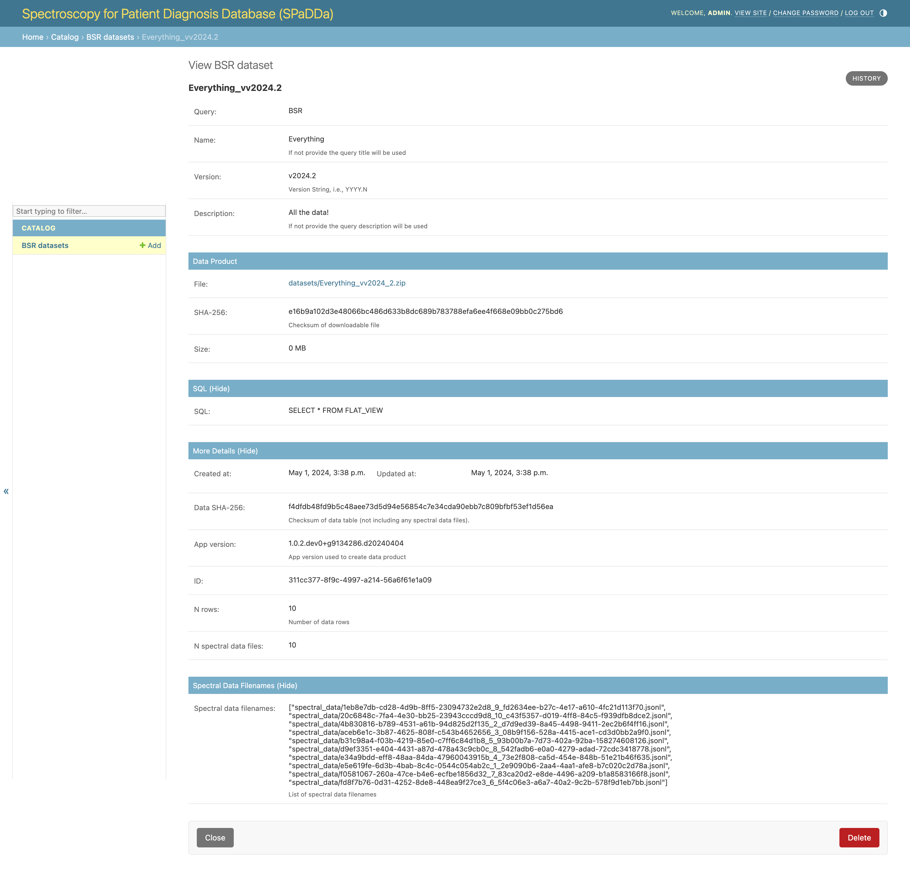

Dataset Catalog
---------------

Usage
^^^^^

When landing on the `/catalog/ <../../catalog/>`_ page you should expect to see the following, where clicking on `BSR datasets <../../catalog/catalog/dataset/>`_ will take you to a list of available datasets to download.

.. note:: "**BSR**" stands for Bio-Sample Repository.

.. note:: Privileged permissions are required to add cataloged datasets, so don't worry if you don't see the ``+Add`` button.

Here's an example list of available datasets.

From there the datasets themselves can be downloaded as zip files by clicking on the link under the ``FILE`` column.

.. note:: As a security measure the download URLs are only temporary. Attempting to use them once they have expired will not work and will result in a ``AccessDenied`` error. To generate new ones, please refresh the page.

Datasets can be filtered by name.

Clicking on the dataset ``NAME`` will then take you to the dataset details.

Details are organized and some will be collapsed, when expanded expect something similar to the following.

Fields
^^^^^^

 - **Query:** The query used to produce a dataset is itself modeled and stored in the database - this field is the query's name. To add new queries see :doc:`sql_explorer`.
 - **Name:** This is the name given to the dataset.
 - **Version:** Datasets are versioned to distinguish between those generated by the same query at different times in the lifetime of the database. I.e., different snapshots as the database contents grows.
 - **Description:** A more verbose text describing the semantics and contents of this particular dataset.
 - **File:** This is the link to the zip file. Click to download.
 - **SHA-256:** The SHA-256 checksum of the entire zip file. See `Computing Data File Integrity`_.
 - **Size:** The size of the downloadable zip file in MB (0MB implies a size of the order of KB).
 - **SQL:** This is the SQL query used to generate the dataset from the database.
 - **Data SHA-256:**: The SHA-256 checksum of the data file archived within the zip file. See `Computing Data File Integrity`_.
 - **App version:** The version of the application deployed and thus used to generate the dataset.
 - **ID:** The primary key for the dataset as stored in the website's main database.
 - **N rows:** The number of rows in the zipped data file. Depending on the query, this could be the total number of patients or something else.
 - **N array data files:** The number of individual array data files zipped within the downloadable zip file.
 - **Array data filenames:** A list of all the file names for all individual array data files zipped within the downloadable zip file.

Computing Data File Integrity
^^^^^^^^^^^^^^^^^^^^^^^^^^^^^

The **SHA-256** field is the SHA-256 checksum of the zip file that once downloaded, its integrity can be verified by computing the checksum and comparing it to the value of this field - they should be identical.

Checksums can be computed on a unix machine (e.g., MacOSX or Linux) via the terminal using the following command::

    shasum -a 256 path/to/downloaded/file.zip

Using a Windows CMD prompt::

    certutil -hashfile C:path\to\downloaded\file.zip SHA256

Similarly the **Data SHA-256** field is the checksum for the data table file archived within the zip file, e.g., "BSR.csv".

.. note:: "**BSR**" stands for Bio-Sample Repository.

