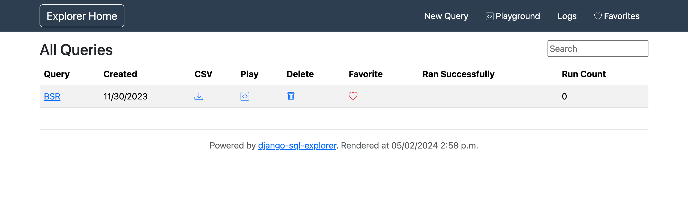
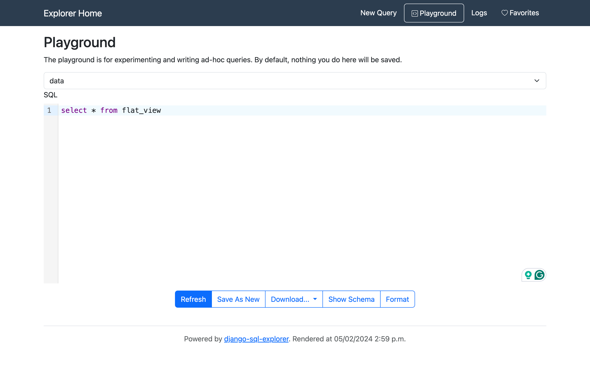
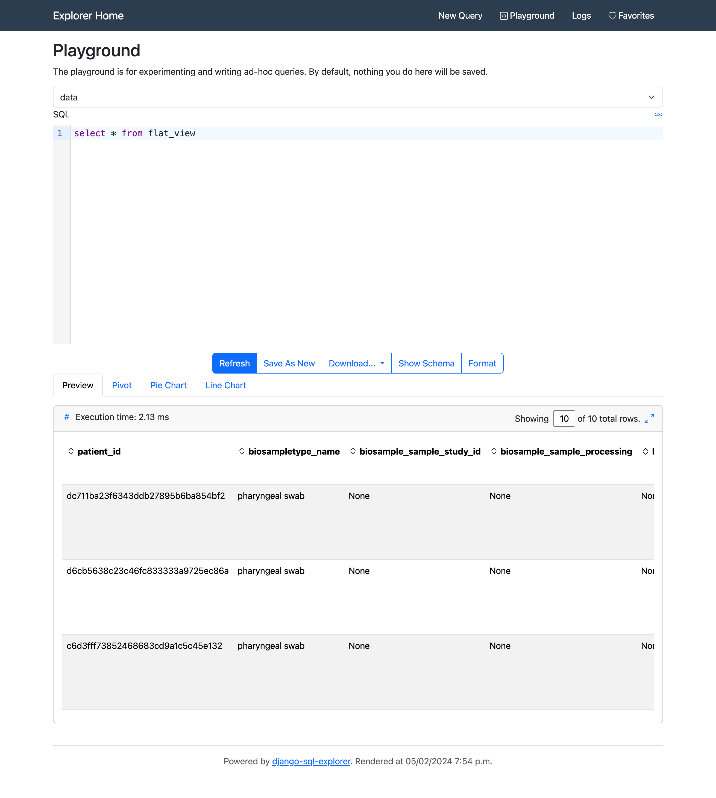
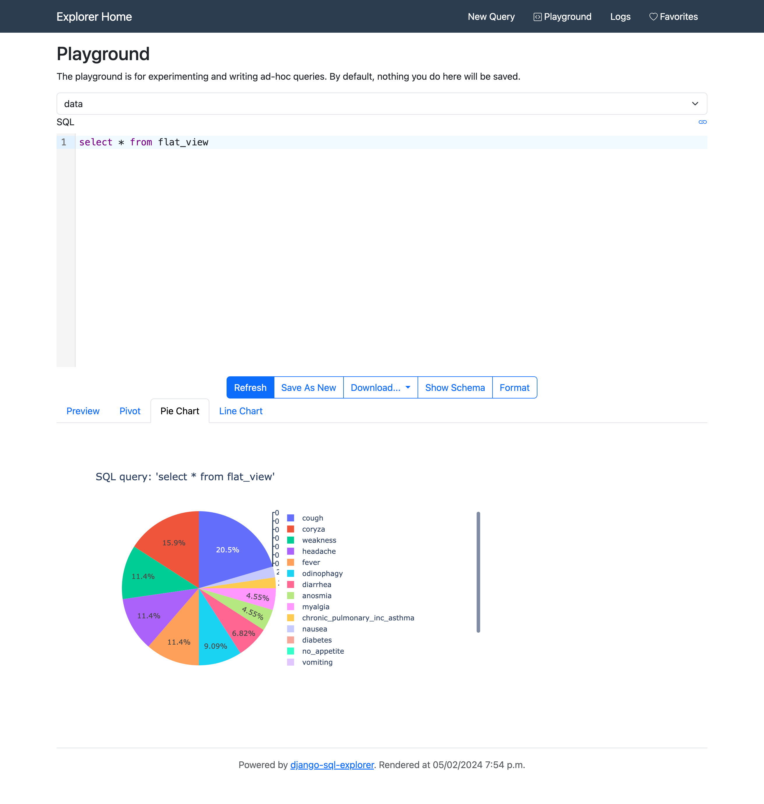
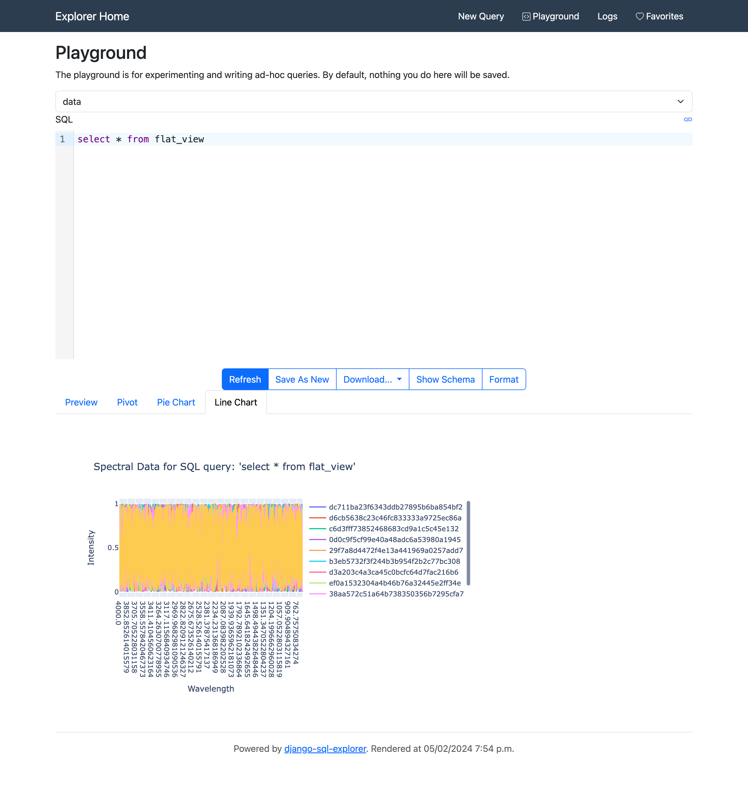
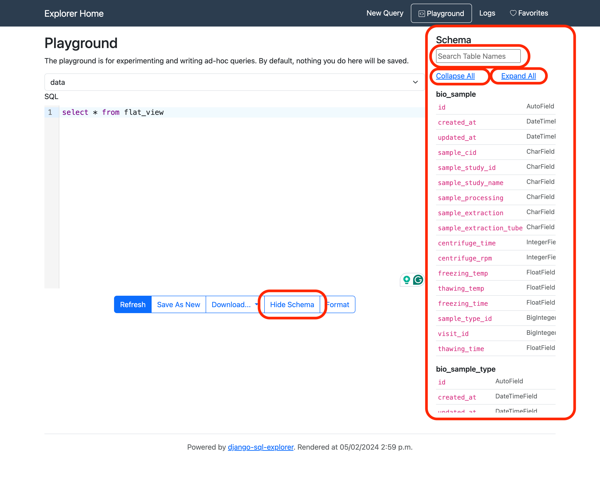
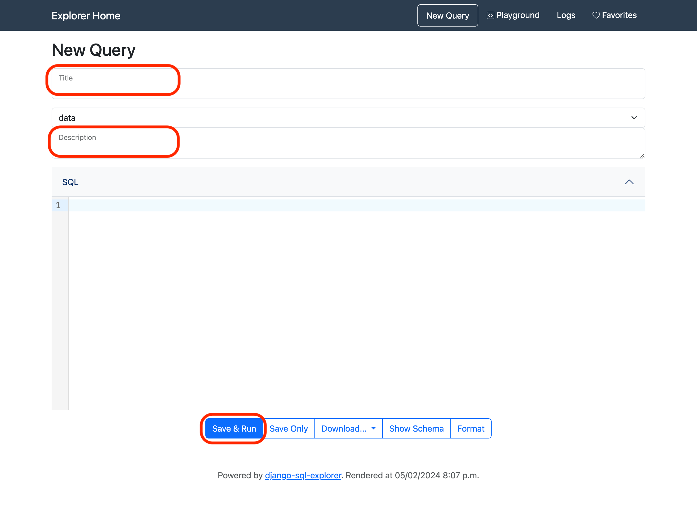

SQL Explorer
------------

Usage
^^^^^

When landing on the `/explorer/ <../../explorer/>`_ page you should expect to see the following.

.. warning:: Privileged permissions are required to use this application as it provides unrestricted read access to the entire database.

.. note:: The SQL explorer application has only read access to the central database.

Playground
^^^^^^^^^^

The `explorer playground <../../explorer/play/>`_ can be used for experimenting and writing ad-hoc queries.

Given the complexity of the underlying data model, a SQL view has been provided, ``flat_view``, flattening the data and thus simplifying SQL queries against it.
For example, to query the entire database the following can be used.

Clicking ``refresh`` will execute the query and load a preview of the data results.

Charts
^^^^^^

Depending on the SQL query executed and the data returned, pie charts and line charts may be available.

A pie chart is available for plotting boolean observations (if present in the resultant data).

A line charts is available for plotting spectroscopy data (if present in the resultant data).

.. note:: Both of these charts are interactive such that the user can include and exclude fields, and also show explicit data values when hovering the cursor over certain regions of the graphs.

Schema
^^^^^^

From both the Playground_ or `New Query`_ page, schemas for the database tables can be viewed, expanded, collapsed, and filtered.

New Query
^^^^^^^^^

The `explorer New Query page <../../explorer/new/>`_ works in almost exactly the same manner as the Playground_, with the added functionality of saving queries for future use.
For saved SQL explorer queries a ``Title`` and ``Description`` can be provided.
Saving queries in this manner is precisely the method needed such that they can be used to generate datasets for the :doc:`datasets`.

