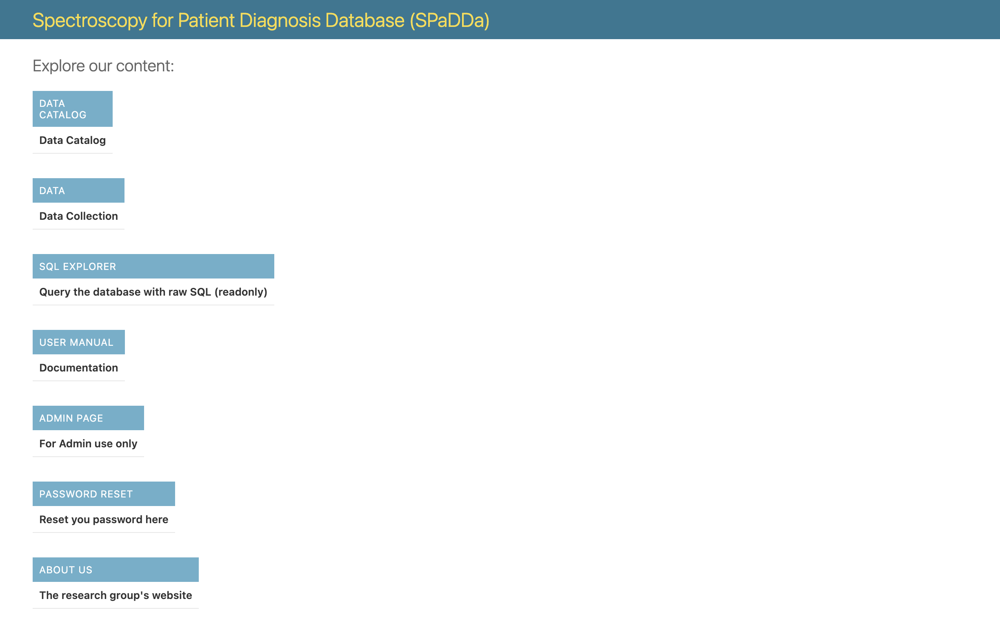

User Manual
===========

**Welcome to package_name's documentation!**

A base template for creating Django applications for collecting patient data.

Contents
--------

.. toctree::

   accounts
   datasets
   data_collection
   sql_explorer

Once logged in, all aspects of the website can be accessed via the following `landing page <../../>`_.

You've probably arrived here for one of two reasons, to download a cataloged dataset or to contribute to data collection (thank you!).

 - For downloading cataloged datasets go to :doc:`datasets`.
 - For contributing to data collection go to :doc:`data_collection`.
